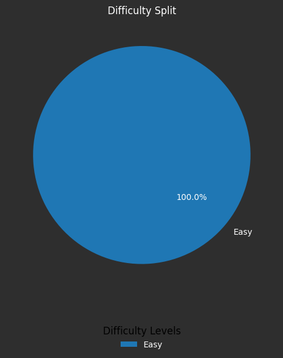

# Kanban Board

  

    <h3 style="color: #ffa500; text-align: center; font-family: Arial, sans-serif;">To Revise</h3>
    <ul style="list-style-type: none; padding: 0;">
      <li style="margin: 10px 0;"><a href="Question-9.py" style="text-decoration: none; color: #dcdcdc; font-weight: bold;">Insertion before the value X in LL</a></li>
      <li style="margin: 10px 0;"><a href="Question-4.py" style="text-decoration: none; color: #dcdcdc; font-weight: bold;">Deletion of the Kth element of LL</a></li>
      <li style="margin: 10px 0;"><a href="Question-8.py" style="text-decoration: none; color: #dcdcdc; font-weight: bold;">Insertion at the Kth position of LL</a></li>
    </ul>
  

  

    <h3 style="color: #6a5acd; text-align: center; font-family: Arial, sans-serif;">Confident</h3>
    <ul style="list-style-type: none; padding: 0;">
      <li style="margin: 10px 0;"><a href="Question-1.py" style="text-decoration: none; color: #dcdcdc; font-weight: bold;">Traversal in Linked List</a></li>
      <li style="margin: 10px 0;"><a href="Question-6.py" style="text-decoration: none; color: #dcdcdc; font-weight: bold;">Insertion at the head of LL</a></li>
      <li style="margin: 10px 0;"><a href="Question-2.py" style="text-decoration: none; color: #dcdcdc; font-weight: bold;">Deletion of the head of LL</a></li>
      <li style="margin: 10px 0;"><a href="Question-5.py" style="text-decoration: none; color: #dcdcdc; font-weight: bold;">Delete the element with value X</a></li>
      <li style="margin: 10px 0;"><a href="Question-7.py" style="text-decoration: none; color: #dcdcdc; font-weight: bold;">Insertion at the tail of LL</a></li>
      <li style="margin: 10px 0;"><a href="Question-3.py" style="text-decoration: none; color: #dcdcdc; font-weight: bold;">Deletion of the tail of LL</a></li>
    </ul>
  

---

## Pie Chart: Difficulty Split

